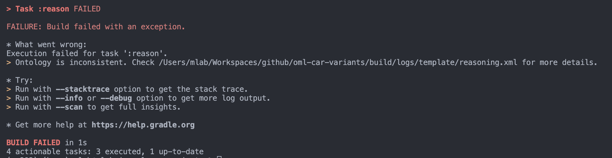
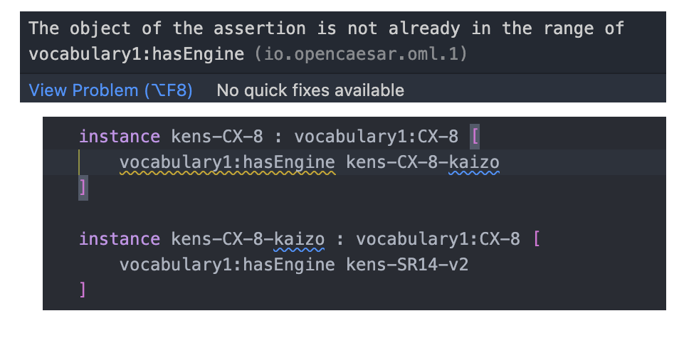
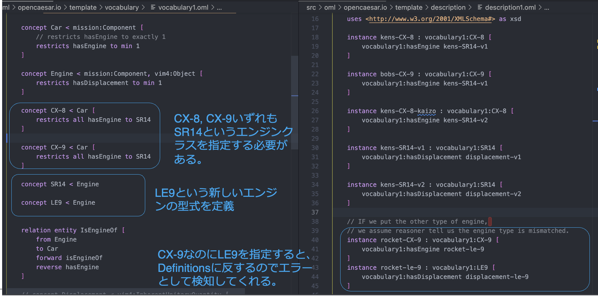
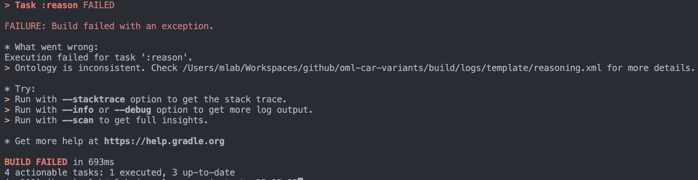
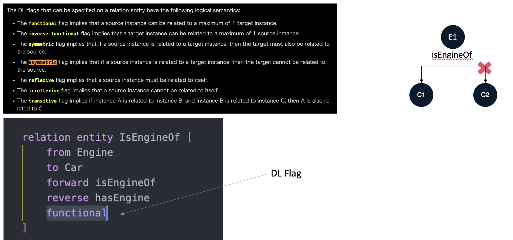

# OML Template

[](https://github.com/opencaesar/oml-template/actions/workflows/ci.yml)
[](https://github.com/opencaesar/oml-template/releases/latest)
[](https://www.opencaesar.io/oml-template/)

This repository has a template [OML](https://github.com/opencaesar/oml) project. It is meant to be forked as a starting point by pressing the 'Use this template' button above.

> this template is suitable for use with OML Rosetta and OML Luxor (but not OML Vision)

## Clone

```
  git clone https://github.com/UTNAK/oml-imce-vocabulary.git
  cd oml-imce-vocabulary
```

## Build

Check the consistency of the dataset

```
./gradlew build
```

## Generate Docs

Generate documentation from dataset

```
./gradlew generateDocs
```

## Start Fuseki Server

Start the Fuseki triple store

```
./gradlew startFuseki
```

Navigate to http://localhost:3030

Verify you see a dataset: `template`

## Stop Fuseki Server

Stop the Fuseki triple store

```
./gradlew stopFuseki
```

## Load Dataset to Fuseki

Load the dataset to Fuseki server

```
./gradlew load
```

Navigate to http://localhost:3030/#/dataset/template/info

Click on `count triples in all graphs` and observe the triple counts

## Run SPARQL Queries

Run the SPARQL queries

```
./gradlew query
```

Inspect the results at `build/results/template`

## Run SHACL Rules

Run the SHACL rules

```
./gradlew validate
```

Inspect the results at `build/logs/template`

## Publish to Maven Local

Publish the OML dataset as an archive in the local maven repo

```
./gradlew publishToMavenLocal
```

Inspect the OML archive

```
ls ~/.m2/repository/io/opencaesar/oml-template
```

## Customize Template

The name of this project is `oml-template`. You can change it to your own project name. The easiest way to do this is to look for the word `template` in this repo and replace it. The files that need to be changes include:

- `.project` (name)
- `.catalog.xml` (first rewriteURI)
- `README.md` (various places)
- `.oml/fuseki.ttl` (fuseki:name)
- `.oml/oml.yml` (various places)
- `src/oml/*` (namespaces of ontologies)
- `src/sparcl/*` (namespaces of ontologies)
- `src/shacl/*` (namespaces of ontologies)

# Experiment #1 : Query and Visualize using Quarto Notebook

1. `R --version`
2. `quarto -V`
3. `./gradlew build`
4. `./gradlew load`
5. `./gradlew query`
6. Then you can find a file of `build/results/template/objective.json`
7. Open `/oml-car-variants/script/objective_report.qmd`
8. `quarto render script/objective_report.qmd
9. Then you will get the `script/objective_report.html`
10. Open in browser

# Experiment #2

## Query 1: Get All the Car

```sparql
PREFIX rdf: <http://www.w3.org/1999/02/22-rdf-syntax-ns#>
PREFIX base:        <http://imce.jpl.nasa.gov/foundation/base#>
PREFIX vocabulary1:        <http://opencaesar.io/template/vocabulary/vocabulary1#>
PREFIX owl: <http://www.w3.org/2002/07/owl#>
PREFIX vim4: <http://bipm.org/jcgm/vim4#>

SELECT DISTINCT*
WHERE {
	?iri a vocabulary1:Car;
  		vocabulary1:hasEngine [
      		vocabulary1:hasDisplacement [
        		vim4:hasDoubleNumber ?displacement
    	]
	]
}ORDER BY ?iri
```

## Query 2: Get All the CX-8

```sparql
PREFIX rdf: <http://www.w3.org/1999/02/22-rdf-syntax-ns#>
PREFIX base:        <http://imce.jpl.nasa.gov/foundation/base#>
PREFIX vocabulary1:        <http://opencaesar.io/template/vocabulary/vocabulary1#>
PREFIX owl: <http://www.w3.org/2002/07/owl#>
PREFIX vim4: <http://bipm.org/jcgm/vim4#>

SELECT DISTINCT*
WHERE {
	?iri a vocabulary1:CX-8;
  		vocabulary1:hasEngine [
      		vocabulary1:hasDisplacement [
        		vim4:hasDoubleNumber ?displacement
    	]
	]
}ORDER BY ?iri
```

# Expetiment #3 Reasoner Test

Using [DL Flag](https://www.opencaesar.io/oml/#UnreifiedRelation-LR), reasoner can detect model inconsistencies.

## Semantic Validation #1 : Car without Engine

エンジンをもたない車のインスタンスを定義

Change `descrpition1.oml` as follows,

```oml
	instance ringos-CX-8 : vocabulary1:CX-8 
```

Then run `./gradlew build`.

You may get a response like this,



Open `/oml-car-variants/build/logs/template/reasoning.xml`.
You can find the error of `Individual violates minimum cardinality restriction`.

This error says `Car` must have more than one `Engine`.

## Semantic Validation #2 hasEngineにCarを指定

正しくはEngineを指定する必要がある

Change `descrpition1.oml` as follows,

```oml
	instance ringos-CX-8 : vocabulary1:CX-8 [
		vocabulary1:hasEngine  ringos-SR14-v1
	]
	instance ringos-SR14-v1 : vocabulary1:SR14[
		vocabulary1:hasDisplacement displacement-ringos-v1
	]
	instance displacement-ringos-v1 : vocabulary1:Displacement [
		vim4:hasDoubleNumber "2000"^^xsd:double
	]
```

エディタに埋め込まれたSyntaxエラー検知機能を使って、オントロジーの使い方の間違いを指摘してくれる。



## Semantic Validation #3 CX-9に異なる型式のエンジンを指定するとエラーとして検知してくれる。

ここでは、CX-9に、LE9というSR14とはことなるエンジンを指定する。

Change `descrpition1.oml` as follows,

```oml
	instance rocket-le-9 : vocabulary1:LE9 [
		vocabulary1:hasDisplacement displacement-le-9
	]
```

Then run `./gradlew build`.

You may get an error response.

Open `/oml-car-variants/build/logs/template/reasoning.xml`.
You can find the error of `An individual belongs to a type and its complement`.



## Semantic Validation #4 : ノード間の関係性（エッジ）に制約を与える

複数の子をもってはいけない

Change `descrpition1.oml` as follows,

```oml
	instance kens-CX-8 : vocabulary1:CX-8 [
		vocabulary1:hasEngine kens-SR14-v1
	]

	instance bobs-CX-9 : vocabulary1:CX-9 [
		vocabulary1:hasEngine kens-SR14-v1
	]
```

Then run `./gradlew build`.

You may get a response like this,



Open `/oml-car-variants/build/logs/template/reasoning.xml`.
You can find the error of `An individual contains a minCardinality restriction that is greater than a maxCardinality restriction`.

This error says the same `Engine` cannot become `isEngineOf` in more than one `Car`.



As Dr. Maged Elaasar mentions [here](https://bentleyjoakes.github.io/assets/publications/Elaasar2023%20-%20openCAESAR%20Balancing%20Agility%20and%20Rigor%20in%20Model-Based%20Systems%20Engineering.pdf), in openCAESAR, analysis happens at two levels. First, the logical consistency of the models is checked using OML and description logic reasoners. Second, other analyses investigate other properties of the system. OML models can easily be checked for logical consistency with an off-the-shelf description logic (DL) reasoner. This check is typically done very early in an analysis pipeline as in the Kepler16b example CI pipeline. Completeness checks can be encoded in a vocabulary directly using minimum/exact cardinality restrictions on properties. They can also be captured using libraries of well-formedness rules that query consistent models. The advantage of the latter is the ability to separate those two concerns, and the ability to use other analyses frameworks than a DL reasoner.

## operational design domain (ODD)

[A Framework for Automated Driving System Testable Cases and Scenarios](https://www.nhtsa.gov/sites/nhtsa.gov/files/documents/13882-automateddrivingsystems_092618_v1a_tag.pdf)

### Vocabulary


### Descriptions


## Scene and Query

```sparql
PREFIX analysis:	<http://imce.jpl.nasa.gov/foundation/analysis#>
PREFIX constraint:	<http://opencaesar.io/firesat-telecom/telecom-supplier/vocabulary/constraint#>
PREFIX rdfs:		<http://www.w3.org/2000/01/rdf-schema#>
PREFIX odd:	<http://opencaesar.io/template/vocabulary/ADSdomain#>

SELECT DISTINCT ?odd ?oe ?iri

WHERE {
#  <http://opencaesar.io/template/description/scene/scene02#odd-2> a odd:JASPARODD;
  VALUES ?oe { odd:Physicalinfrastructure odd:EnverionmentalCondition odd:TrafficParticipants}
  VALUES ?relation { odd:isPIOf odd:isECOf odd:IsTPOf}
  ?iri a ?oe;
     ?relation <http://opencaesar.io/template/description/scene/scene01#odd-01>

}ORDER BY ?odd ?oe
```
